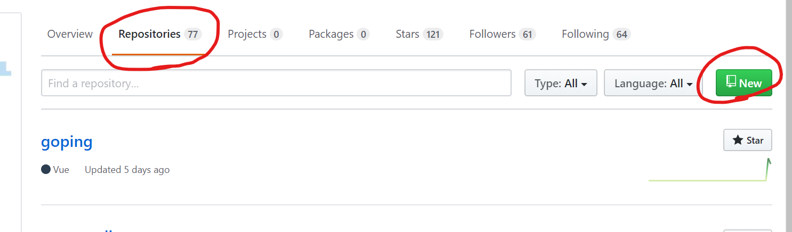
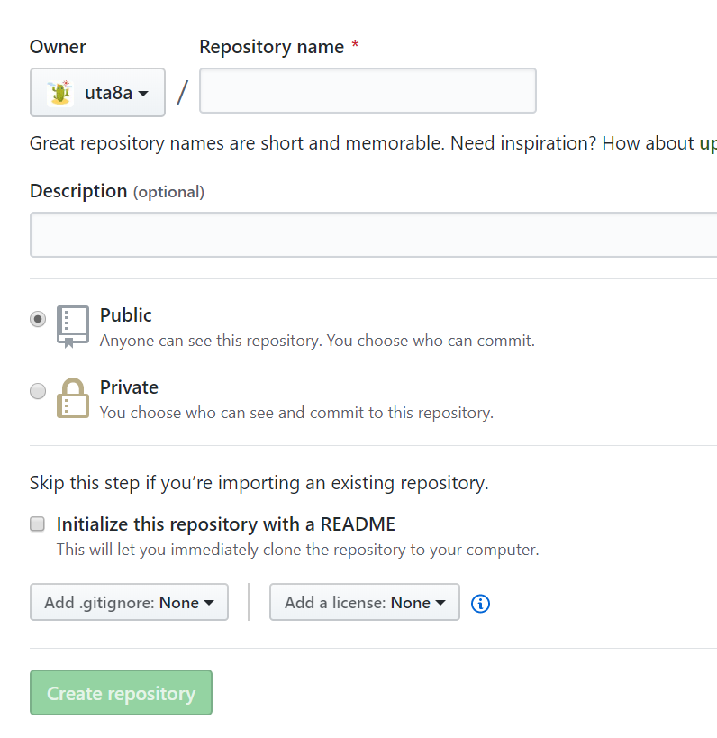
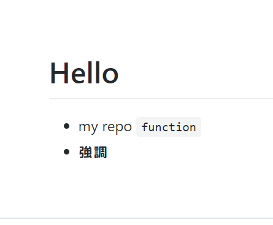
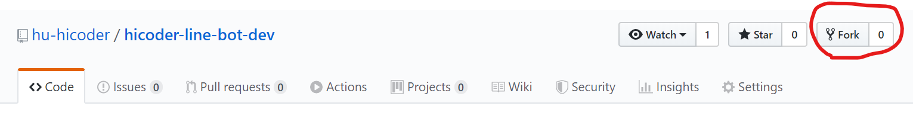

- このセクションでは、gitの導入とGitHubへの接続、markdownの書き方を習得します。

# 課題5
- Linuxのコマンドに慣れてみよう。どんなコマンドを打ったのか、discordに書いてみる
## 手順
- 今、Windowsで自分が決めた作業フォルダを指定してVSCodeで開き、VSCodeのターミナルを開くと、右上の方に以下のように`1:bash`と表示されていると思います。


- (もしそうならない、そこまで行かない場合はdiscordでどこまで行けたか、どこで躓いているかを添えて質問してみてください)
- おそらくLinuxに馴染みのない人もいると思うので説明します。これからLinuxを使っていくときは、ボタンを押して操作すること(GUIによる操作)は少なく、黒いターミナルにコマンドを打ち込んで操作することが多いです(CLIによる操作)いわゆるハッカーのような、黒い画面にカタカタとコマンドを打ち込む姿を想像するとよいかもしれません。
- それでは、Linuxのコマンドを打ってみましょう。
```
echo Hiroshima
```
- と打つと`Hiroshima`と表示されたかと思います。これは、文字列を表示するコマンドという風に捉えておくとよいです。
- `echo`は標準で使えるコマンドですが、自分でソフトウェアをインストールして使うこともできます。`git`がその一例です。
- `sudo apt install <package name>`でインストールできます。たとえば、
```
sudo apt install htop
htop
```
- と打ってみてください。この状態を抜けるには`q`を押します


- これはメモリ使用量の確認や、プロセス(今コンピュータ上で動いているプログラム)の概要を示すコマンドです。
- 以下の参考をもとに、いくつか標準で入っているコマンドを打ったりしてみてください。参考: https://parashuto.com/rriver/tools/mac-command-line-basics
- **注意** 削除と移動、rmとmvコマンドは気をつけてください。Windows側にも影響を及ぼす可能性があるので、気をつけて使ってください(使い方によっては、最悪パソコンが壊れることもあります)
- なにかコマンドを打ったり、ソフトウェアをインストールして使ってみたら`history`コマンドで自分がどんなものを打ったのか確認しましょう。
- 確認できたら、どんなコマンドを打ったのかdiscordの開発チャンネルに書いてみてください！

# 課題6
- Gitの導入と、Gitについて調べたことをdiscordに書いてみる
## 手順
- gitは自分の書いたコードの履歴を管理するツールです。コードを書いていると、「1日前に書いたコード消しちゃったけどまた見たいなぁ...」ということが起こります。失敗したときに巻き戻したいと思うこともあります。そんなときに、gitを使っていると履歴をさかのぼって以前の状態を復元できます。ただしオートセーブ機能はないので、自分でこまめにセーブする必要があります。
- gitはWSLのターミナルから、以下のコマンドを打ちインストールします。
```
sudo apt install git
```
- インストールが終わったら、確認します
```
git --version
```
- `git version <number>`みたいなのが返ってきたら成功です。
- これでgitは導入できました。次はgitについて検索をかけてみましょう。
- 課題
    - `git`と`GitHub`の違いはなにか
    - gitでどんなことができるか
- 課題の2問を調べて、自分なりの答えをdiscordの開発チャンネルに書いてください。

# 課題7
- GitHubとのSSH接続確認

## 手順
- これはとてもむずかしいです。ここは失敗しやすいのですが、めげずに挑戦しましょう。
- 目標は、自分のパソコンとGitHubのサーバーをつなぎ、gitで管理しているファイルを公開することです。(非公開にすることもできますが、基本的に全世界誰からでも見れる状態になるので気をつけてください)
- 基本的な手順はここ( https://github.com/hu-hicoder/web-reading/blob/master/c1-wsl-github.md#github%E3%82%92%E4%BD%BF%E3%81%8A%E3%81%86 )に書いてあります。
- また、「GitHub SSH接続」とかで検索をかけて調べても良いと思います。
- `ssh git@github.com`が成功したらdiscordでできたことを報告してください。
- おそらく一回でうまくいくことは稀なので、詰まったらどこで詰まったかを添えてdiscordで質問してみてください。

# 課題8
- GitHub上でリポジトリを作り、そこに手元で作ったローカルリポジトリをpushする

## 手順
- GitHubとのSSH接続確認ができている状態だと思います。
- まずはGitHub上でリポジトリを作ってみましょう。
- 以下の図のように、自分のプロフィールページから`Repositories`を押して移動し、`New`ボタンを押してください



- 下の図のように、リポジトリの名前を決めるところがでてきたと思います。リポジトリの名前は、Alphabet大文字小文字、数字、ハイフン(`-`)、アンダーバー(`_`)から使うようにしましょう。スペースを入れたり日本語を入れるのは避けたほうがよいです。
- Create Repositoryを押してリポジトリ完成です。



- 次に、ローカルリポジトリを作ります。手元のPCで、VSCodeを立ち上げてターミナルを開いてください。
- 作業フォルダで`mkdir <repository name>`と打ちます。`<repository name>`には自分で決めた名前が入ります。例えば、`mkdir hicoder-dev`という感じです。
- `cd <repository name>`でそのフォルダに移動します。
- `git init`で新しく作ったフォルダ内でgit管理しますよ、という宣言をします。これでローカルリポジトリは完成です。なにかファイルを追加してみましょう。
- VSCodeで`<repository name>`の内側に、`README.md`というファイルを作ってください。
- `README.md`を開き、
```
# Hello
- my repo
`function`
- **強調**
```
- と打ち込んで`Ctrl+s`で保存してください。
- これを今からGitHubのサーバにあげて公開状態にします。
- 今、ターミナルは`/<なにか>/<repository name>`の場所にいると思います。ここで`git remote add origin <repository>`と打ちます。ここについては、GitHubのリポジトリの説明欄に詳しく書いてあるので、そこを見ると良いと思います。おおまかな流れとしては、
    - `git remote add ...`でリモートブランチを登録
    - `git add --all`でローカルのファイルをすべて(ここではREADME.mdを指します)上げる準備をする。
    - `git commit -m "<comment>"`で変更に対するコメントをつけておく
    - `git push origin master`でoriginにmasterブランチをpush(ここで公開されます)
- 途中で分からなくなったら検索してみたり、discordで質問してみましょう。
- 以下のようなものが表示されたら成功です！成功したら、discordで自分が作ったリポジトリのURLを教えて下さい。




# 課題9
- markdownの書き方を調べる。自分のリポジトリにその変更をpushする。

## 手順
- ここでは課題8で書いた`README.md`について詳しくなることを目標にします。
- Markdownというのは、高機能テキストファイルのように捉えておくとよいです。GitHubは標準でMarkdownをテキストからhtmlに変換して表示してくれるので、Markdownが書けると便利です。
- 書き方
    - `<file-name>.md`というファイルを作る(`<file-name>`は自分で決めた名前です)
    - 見出しは `# `
    - 箇条書きは `- `
    - コードブロック
    - 改行は
    - ...
- [Common Mark](https://spec.commonmark.org/0.29/)を見るとほぼすべての書き方についての情報が分かりますが、普段は「Markdown 書き方」や「Markdown チートシート」みたいな検索をかけて調べることが多いです。
- 自分のリポジトリの`README.md`を、markdownの様々な書き方を使って書き換えてみてください。できたらdiscordでURLを教えて下さい。

# 課題10
- 演習: markdownを書いて、それをHiCoderのGitHubに向けてプルリクを送ろう
- ここはかなり難しくややこしいので自分でもうまく説明できてないと思います。検索したり、discordで質問をしてください。
- 参考記事: https://qiita.com/wataryooou/items/8dce6b6d5f54ab2cef04
## 手順
- GitHubを使えて、gitをひとりで使えるようになったと思います。ここからチーム開発する準備として、プルリクを送るということを学んでいきます。
- チームで開発するときは担当箇所を分担して、お互いコードを書いたときに同じところを書いちゃったりしないようにします。今回はpull requestというGitHubの機能を使っていきます。
- pull requestとは、今回でいうと「HiCoderのリポジトリにこういう変更を加えたいです」という提案のようなものです。今回は僕がその変更提案を見て、OKだと思ったら取り入れて、不備があれば直してもらいます。なので、「送っていいのかな...」と怖がることなく、どんどん提案を送ってきてください！
- それでは手順を説明していきます。
- まず https://github.com/hu-hicoder/hicoder-line-bot-dev をforkして自分のところにリポジトリを持ってきます。
- 下の図で、Forkというボタンを押せばできます。



- 次に作業するフォルダ(自分のgitリポジトリとは別の場所にしましょう)でVSCodeを開いて、HiCoderのリポジトリを持ってきます。
- `<forkしたリポジトリ>`は、forkした自分のところにあるリポジトリのページで緑色の`Clone or download`を押してみると、`git@github...`という文字列が見えると思うので、それをコピーして使ってください
```
cd <作業フォルダ>
git clone <forkしたリポジトリ> 
```
- リモートリポジトリを手元に持ってくることができたと思います。
- 続いて、branchを変更します。branchがなにかは「git branch とは」などで検索をかけてみてください。
- `git checkout -b dev`と打ち込んでください。devというブランチに移動します。
- 中身を変更します。
- パス`hicoder-line-bot-dev/docs/workspace/<username>`というフォルダを作ってください。(すでにuta8aというフォルダがあると思うので、それと同じ階層に自分のgithub usernameのフォルダを作ってください)
- そこに`README.md`ファイルを作成してください。中身は、これから調べたことなどを全体に共有するために使います。
- 試しに、今回の課題10で学んだことを書いてみてください。
- 変更できたら、`git add --all` `git commit ...`してください。
- これを自分のリポジトリのリモートブランチに変更を反映させます。
```
git push origin dev
```
- masterではなくdevであることに注意してください。リモートのoriginにむけて、devブランチをpushしています。
- ここで世界に公開された状態になりました。GitHubの自分のページからリポジトリ(forkしたもの)に行ってください。branchが増えていて、変更が反映されていると思います。
- `New pull request`というボタンがあるのでそこから、`<username>/dev` -> `hu-hicoder/master`に向けてpull requestを作ってください。特にコメントなどはなくても大丈夫です。このあたりは参考記事を見るとわかりやすいかと思います。
- 最終的にpull requestが送れたら、`課題10 終わりました、プルリク送りました`と連絡してくださると嬉しいです。

# 休憩
- ここまでお疲れさまでした。色々分からないことが出てきたと思います。わからないことは`workspace/<username>/README.md`に書いてまたプルリクを作って送ってください。面倒ですが慣れが大切なので、頑張っていきましょう。
- 不備や分かりにくいところ見つけたら指摘をお願いします。資料を良くしていきたいので、反応頂けると嬉しいです。
- 次はいよいよJavaScriptを学んでいきます。
- [次の課題へのリンク](./chall-js.md)