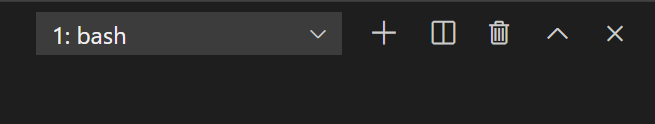
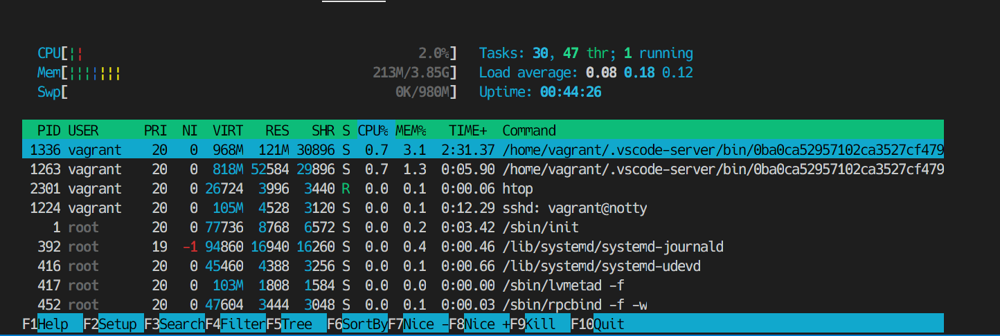

- このセクションでは、gitの導入とGitHubへの接続、markdownの書き方を習得します。

# 課題5
- Linuxのコマンドに慣れてみよう。どんなコマンドを打ったのか、discordに書いてみる
## 手順
- 今、Windowsで自分が決めた作業フォルダを指定してVSCodeで開き、VSCodeのターミナルを開くと、右上の方に以下のように`1:bash`と表示されていると思います。



- (もしそうならない、そこまで行かない場合はdiscordでどこまで行けたか、どこで躓いているかを添えて質問してみてください)
- おそらくLinuxに馴染みのない人もいると思うので説明します。これからLinuxを使っていくときは、ボタンを押して操作すること(GUIによる操作)は少なく、黒いターミナルにコマンドを打ち込んで操作することが多いです(CLIによる操作)いわゆるハッカーのような、黒い画面にカタカタとコマンドを打ち込む姿を想像するとよいかもしれません。
- それでは、Linuxのコマンドを打ってみましょう。
```
echo Hiroshima
```
- と打つと`Hiroshima`と表示されたかと思います。これは、文字列を表示するコマンドという風に捉えておくとよいです。
- `echo`は標準で使えるコマンドですが、自分でソフトウェアをインストールして使うこともできます。`git`がその一例です。
- `sudo apt install <package name>`でインストールできます。たとえば、
```
sudo apt install htop
htop
```
- と打ってみてください。この状態を抜けるには`q`を押します



- これはメモリ使用量の確認や、プロセス(今コンピュータ上で動いているプログラム)の概要を示すコマンドです。
- 以下の参考をもとに、いくつか標準で入っているコマンドを打ったりしてみてください。参考: https://parashuto.com/rriver/tools/mac-command-line-basics
- **注意** 削除と移動、rmとmvコマンドは気をつけてください。Windows側にも影響を及ぼす可能性があるので、気をつけて使ってください(使い方によっては、最悪パソコンが壊れることもあります)
- なにかコマンドを打ったり、ソフトウェアをインストールして使ってみたら`history`コマンドで自分がどんなものを打ったのか確認しましょう。
- 確認できたら、どんなコマンドを打ったのかdiscordの開発チャンネルに書いてみてください！

# 課題6
- Gitの導入と、Gitについて調べたことをdiscordに書いてみる
## 手順
- gitは自分の書いたコードの履歴を管理するツールです。コードを書いていると、「1日前に書いたコード消しちゃったけどまた見たいなぁ...」ということが起こります。失敗したときに巻き戻したいと思うこともあります。そんなときに、gitを使っていると履歴をさかのぼって以前の状態を復元できます。ただしオートセーブ機能はないので、自分でこまめにセーブする必要があります。
- gitはWSLのターミナルから、以下のコマンドを打ちインストールします。
```
sudo apt install git
```
- インストールが終わったら、確認します
```
git --version
```
- `git version <number>`みたいなのが返ってきたら成功です。
- これでgitは導入できました。次はgitについて検索をかけてみましょう。
- 課題
    - `git`と`GitHub`の違いはなにか
    - gitでどんなことができるか
- 課題の2問を調べて、自分なりの答えをdiscordの開発チャンネルに書いてください。

# 課題7
- GitHubとのSSH接続確認

## 手順
- これはとてもむずかしいです。ここは失敗しやすいのですが、めげずに挑戦しましょう。
- 目標は、自分のパソコンとGitHubのサーバーをつなぎ、gitで管理しているファイルを公開することです。(非公開にすることもできますが、基本的に全世界誰からでも見れる状態になるので気をつけてください)
- 基本的な手順はここ( https://github.com/hu-hicoder/web-reading/blob/master/c1-wsl-github.md#github%E3%82%92%E4%BD%BF%E3%81%8A%E3%81%86 )に書いてあります。
- `ssh git@github.com`が成功したらdiscordでできたことを報告してください。
- おそらく一回でうまくいくことは稀なので、詰まったらどこで詰まったかを添えてdiscordで質問してみてください。

# 課題8
- リモートへのpush

# 課題9
- markdownの書き方

# 課題10
- 演習: markdownを書いて、それをGitHubへpushしてみよう

# 休憩