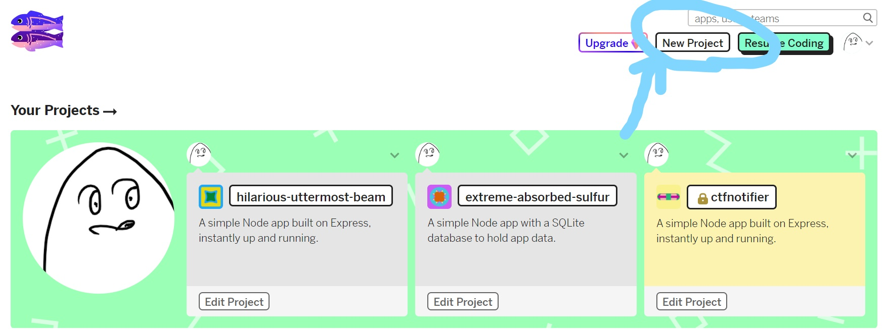
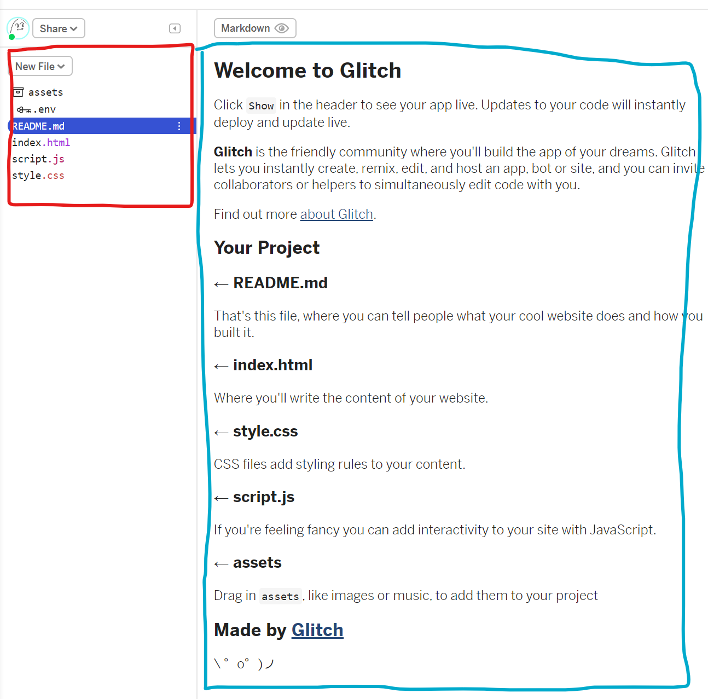
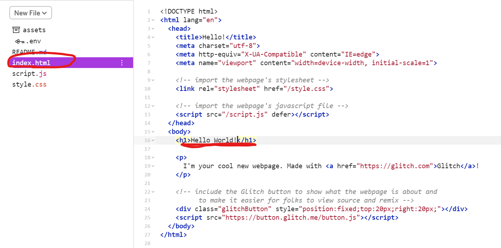
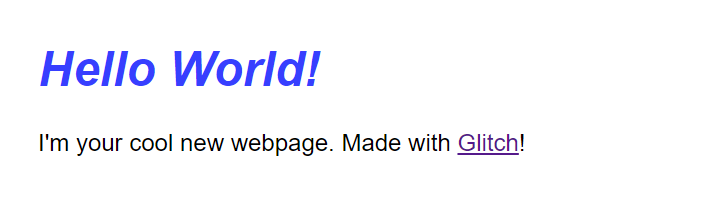

# 課題1
- GitHubのアカウントを作って、discordの開発チャンネルにアカウント名と自己紹介を載せてください
## 手順
- GitHubアカウントを作ります。 https://github.com/ からSign Upしてください。usernameは**実名とは別の**ハンドルネームが良いと思います。また、メールアドレスは公開してもよいものを使ってください。
- わからなくなったら検索してみましょう。「GitHub アカウント 作り方」などでGoogle検索をかけてみてください。
- 困ったらdiscordの開発チャンネルで質問してみましょう。
- アカウント名は、 https://github.com/uta8a だと`uta8a`にあたります。自分のページからアカウント名を発見してください。
- discordの開発チャンネルにアカウント名を載せてください。プログラミングの経験などがもしあればそれも書いてくれると嬉しいです。discordでは外部の方もいるのでハンドルネームを使うように気をつけてください。

# 課題2
- glitch( https://glitch.com/ )を使って遊び、自分なりに調べたことや分かったことをdiscordの開発チャンネルに書いてください。
## 手順
- https://glitch.com/ にアクセスしてみてください。Sign inからGitHubのアカウントでログインできます。
- 以下のように、New Projectから新しいProjectがつくれます。ここでProjectは、websiteやwebサービスのようなひとつのまとまりを意味しています。
    - hello-webpage: websiteが作れます
    - hello-express: サーバーサイド側も含めたwebsiteが作れます
    - hello-sqlite: データベースを含めたwebサービスが作れます



- ここでは例として、hello-webpageを選択してみます。
- 下の図はプロジェクトを選択した後の状態です。左の赤枠がファイル選択、右が選択したファイルの中身になっています。



- `Show`というボタンを押して`In a New Window`を選択すると、Webpageが見られると思います。
- それではここで少しこのwebsiteに手を加えてみましょう。
- 下の図のように、ファイル選択から`index.html`を選択して、右側の`Hi! there`を好きな文字列に変更してみてください。ここでは以下のように、Hello World!という文字列に変更しています。
```
<h1>Hello World!</h1>
```



- ここで先程のWebpageのタブを見に行くと...



- このように表示される文字が変わりました！
- 文字を足したり、文字の色を変えたりすることができます。遊んでみましょう。
- おそらくどこを変更したらいいか分からないと思います。検索してみましょう。「HTML 書き方」「CSS 文字色 変更」などで検索してみてください。もちろん詰まったらぜひdiscordの開発チャンネルで質問してみてくださいね。
- 参考ですが、MDNというところにHTML/CSSといったWebpageについての知識が集まっています。 https://developer.mozilla.org/ja/docs/Learn/HTML/Introduction_to_HTML/Getting_started
- 「MDN HTML 初歩」とかで検索をかけてみるとよいでしょう。
- 最後に、なにか変更を加えてみて学んだことをdiscordの開発チャンネルで報告してみてください。(`課題2終わりました！こんなことがわかりました、ここがわかりませんでした` みたいな感じだと嬉しいです)

# 休憩
- ここからは基礎練習のようなものに当たります。ひとつひとつは退屈で面倒かもですが、必要になるので頑張っていきましょう。
- また、検索する技術が後々重要となってくるので、ここではそれも身に付けてほしいなと思っています。そのため説明は今後それほど丁寧ではなくなります。たくさん検索をして検索する力を向上させていってください。

# 課題3
- エディタの導入をします。特にこだわりがなければVSCodeを使ってください。エディタはコードを書くための道具で、いろいろな機能がついているので便利です。
-  エディタをダウンロードして、少し使ってみましょう。
## 手順
- VSCodeはマイクロソフト社が主に開発している高機能なエディタです。
- ダウンロードはここからできます。 https://code.visualstudio.com/
- 以下の参考の`Visual Studio Code の準備`が参考になると思います。頑張ってください。
- 参考: https://ynucpc.github.io/blog/2020/03/24/howtowsl-vscode/
- インストールできたら、使い方を学びます。
- まず、作業フォルダを決めます。開発用のフォルダはまとめておくと後々整理しやすいです。これは僕の例ですが、`C:\Users\<username>\project`というように`project`というフォルダを自分の名前のフォルダの下に作り、その下で`workspace`というフォルダを作り、そのさらに下に開発プロジェクトごとにフォルダを作っています。例えば今この文書に関することは`C:\Users\<username>\project\workspace\hicoder-dev`で管理しています。自分なりに一箇所にまとめておくとよいでしょう。
- 作業フォルダを決めたらその中でVSCodeを開きます。そしてファイルを作ります。`test.txt`というように、テキストファイルがよいでしょう。
- このあたりのVSCodeの操作方法は「VSCode 操作方法」などで検索をかけるといいと思います。さきほどの参考記事( https://ynucpc.github.io/blog/2020/03/24/howtowsl-vscode/ )も役に立つでしょう。
- VSCodeを少し使ったら、どんな機能を使ったかdiscordの開発チャンネルで教えて下さい。`課題3終わりました、VSCodeからファイルを作りました！`とかでOKです。

# 課題4
- WSLの導入をします。これはWindowsの方が対象です。Macの方はdiscordで連絡してください。
- WSLを導入して、コマンドラインで`echo Hello`と打って出てきた結果をスクショしてdiscordに貼り付けてください。
## 手順
- まず、OSについて説明します。OSはコンピュータを動かしている大事なプログラムです。Windows, Android, MacOS, LinuxのようにたくさんのOSがあります。その中でWindowsで開発を行うことは初心者には難易度が高く、Linuxで開発を行う方が簡単なように僕は感じたので、今回はWindowsの上でLinuxを動かして、その上で開発を行います。
- つまり、開発環境としてWSLを使います。
- https://ynucpc.github.io/blog/2020/03/24/howtowsl-vscode/ こちらの記事でWSLの導入方法とVSCodeの設定(settings.json)が触れられています。これを参考にWSLを導入してください。usernameはスペースを使わないで、自分の名前と関係ない短いものにすると良いと思います。例えば僕は`uta8a`か`kaito`を使っています。
- なにか困ったことがあればdiscordで質問してください。これはたいへん難しい課題だと思います。
- できたらUbuntuを起動して、
```
sudo apt update
sudo apt upgrade
```
とパッケージの更新をして、
```
echo Hello
```
- と打ってEnterを押してみてください。画面に`Hello`と表示されたらOKです。
- その画面のスクショをとって、discordにあげてください。画面に写っている情報には気をつけてください(usernameを実名にしている場合など)

# 休憩
- お疲れさまでした！ここまでで一旦一休みです。今まで、GitHubのアカウントを作り、Glitchですこし遊び、エディタとWSLで開発環境を構築できたと思います。
- 次は開発で使うツール`Git`と、なにか文書を書くときのツール`Markdown`について学びます。
- [次の課題へのリンク](./chall-git-markdown.md)