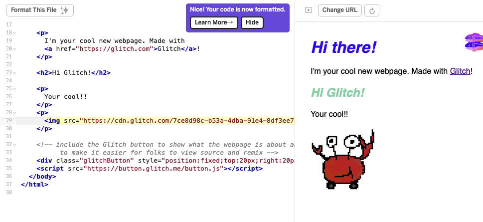

# kugi's TASKs

## Project Setup
- [x] 課題1

  工学研究科2年のkugiです!よろしくお願いします!
https://github.com/kugimasa

- [x] 課題2

  自分が使っている[配色ツール](https://coolors.co/74d3ae-a6c48a-f6e7cb-dd9787-6cbe40)を紹介します！
５色の配色をランダムで生成してくれるツールです。
一部ロックしたりもできます。

  あとGlitchで画像を入れたいときは

  ``

  とかではなく、`assets`で生成されるURLをコピーして使う必要があるみたいです。
  

- [x] 課題3

  VSCode入ってます👍
- [x] 課題4

  Macユーザです💻

## How2Use git and markdown
- [x] 課題5

  `htop`入れてみました！
- [x] 課題6・7・8・9・10

  `git`関連まとめちゃいました...💦🙇‍♂️

  `fork`したものからPR送りました👍
  `fork`したものからPR送るのは初だったのでちょっとドキドキしました👀

  

## Frontend & Backend in JavaScript
- [ ] 課題11
- [ ] 課題12