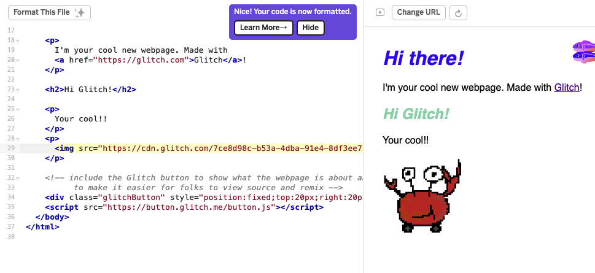

# kugi's TASKs

## Project Setup
- [x] Step1

  [課題1] 工学研究科2年のkugiです!よろしくお願いします!
https://github.com/kugimasa

- [x] Step2

  [課題2] 自分が使っている[配色ツール](https://coolors.co/74d3ae-a6c48a-f6e7cb-dd9787-6cbe40)を紹介します！
５色の配色をランダムで生成してくれるツールです。
一部ロックしたりもできます。

  あとGlitchで画像を入れたいときは

  ``

  とかではなく、`assets`で生成されるURLをコピーして使う必要があるみたいです。
  
- [x] Step3

  [課題3] VSCode入ってます👍
- [x] Step4

  [課題4]Macユーザです💻

## How2Use git and markdown
- [ ] Step5
- [ ] Step6
- [ ] Step7
- [ ] Step8
- [ ] Step9
- [ ] Step10

## Frontend & Backend in JavaScript
- [ ] Step11
- [ ] Step12